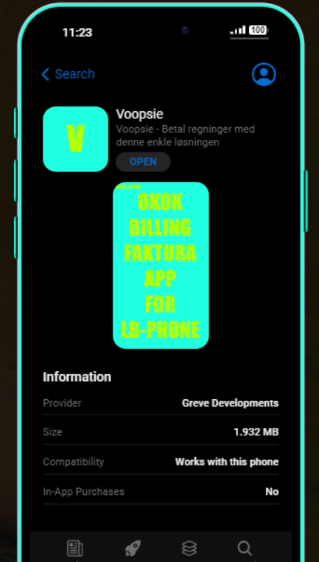

#Backstory and reason for making this:

Since I haven't been able to find any freebies regarding this topic, I sat down and made it myself for the community and anyone who has been looking for this - its licensed under gnu as i dont feel satisfied in making people pay for a few lines
# INvoice App / Billing App for LB-Phone (OKOKBilling - QB)

Credit to maxifaxipaxi for the flappy bird game where i borrowed some lines from - https://lb.mfpscripts.com/

LB-Phone: 

https://lbphone.com/

QB: https://okok.tebex.io/package/5246435

Disclaimer:

This should work on ESX too as long as the export to get the billing menu is the same as qb!

# add to lb-phone\config\config.json

# Preview i Appstore


```
        "voopsie": {
             "name": "Voopsie",
             "removable": true,
             "size": 2000
        },
```
